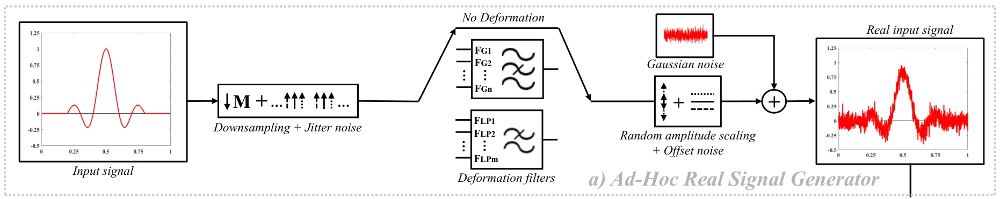
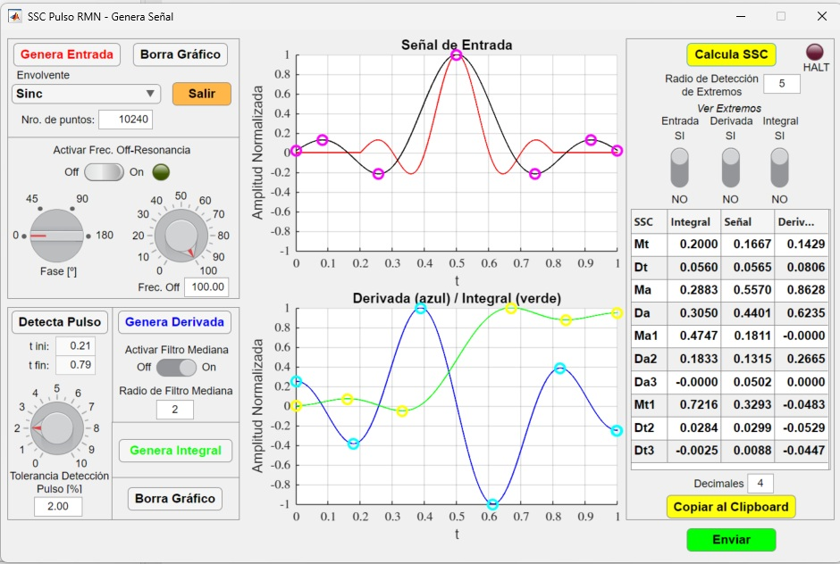
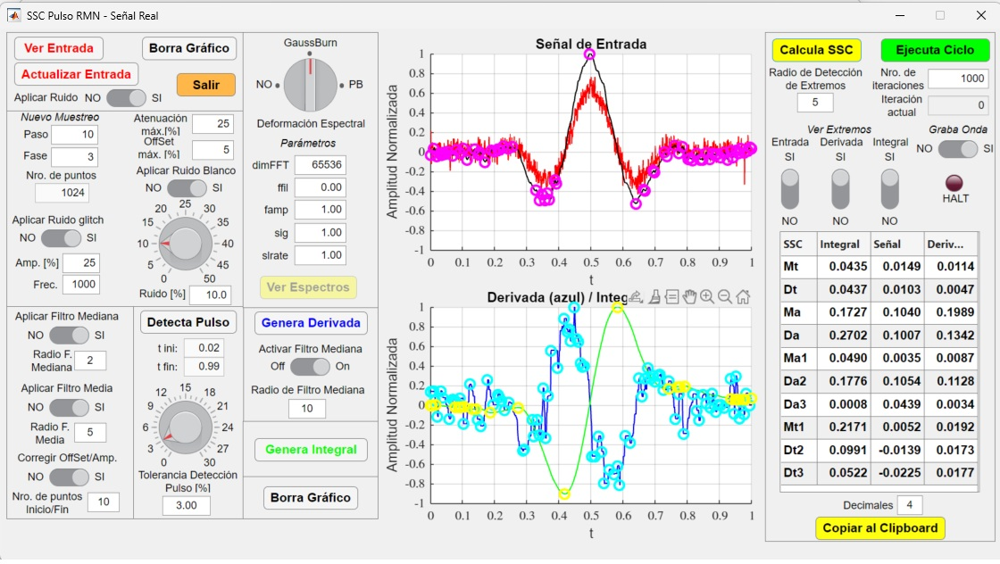
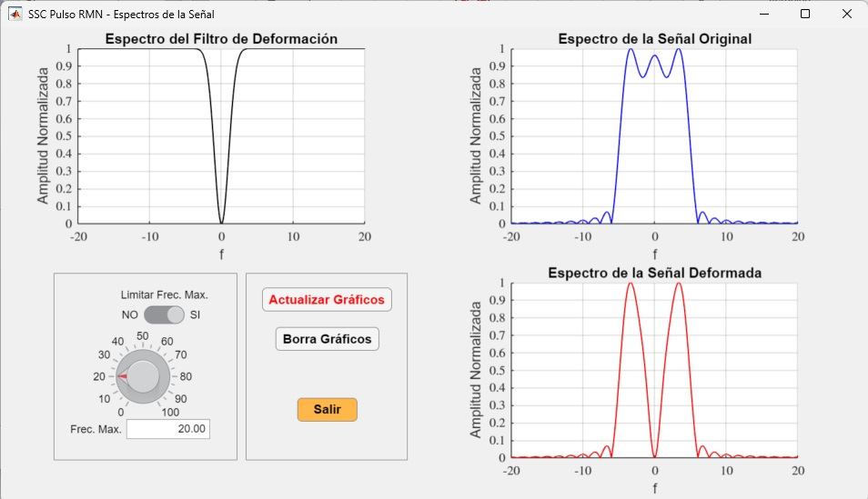
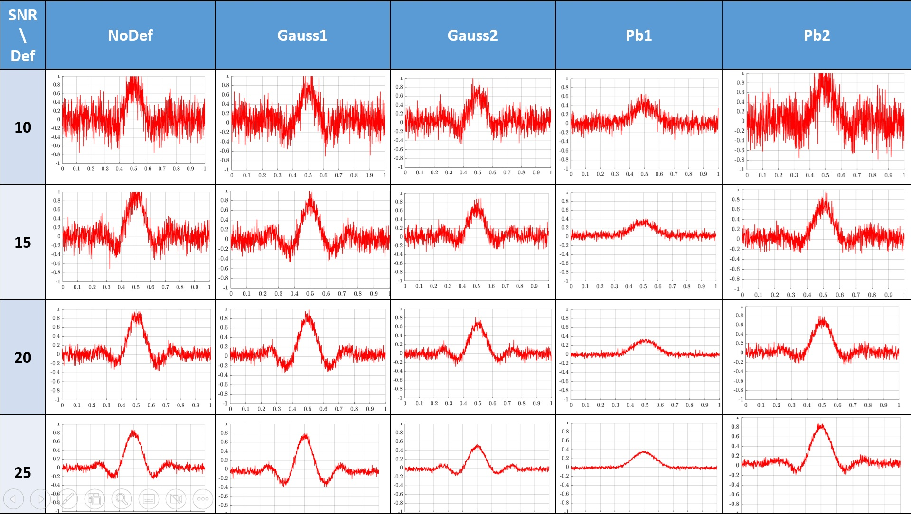
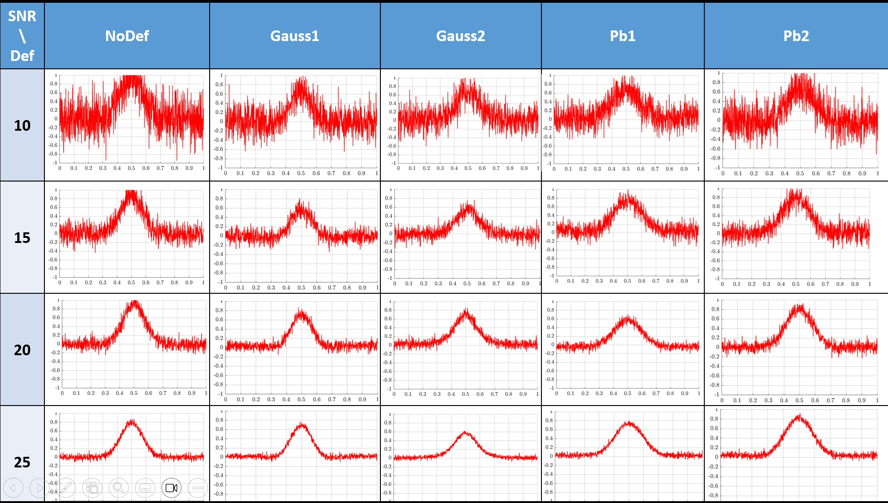
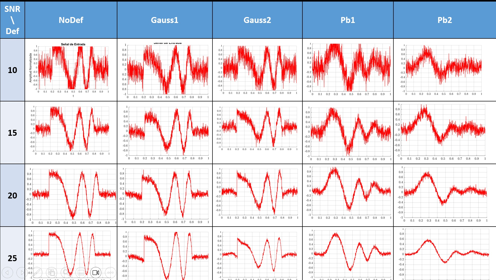

# Pulsed-LikeSignal-Generator
This project contain the app to generate Sinc, Gauss and Chirp signal with different levels of Gaussian random noise, filter deformation and ESSC parameter extraction 
generating two type of data files, one with ESSC parameters extracted from the signal and the other with raw signal samples (amplitude and time).

<figure>
  

  
  

</figure>

	Signal and deformed signal by GaussBurn filter type deformation.

     

## Installation
In Matlab, go to `Apps Tab` and then `Install App` search for `SSC Pulso RMN - GN - DL` file and open it.

### How to use it:

Ones the app was installed, find it in APPS tab and open it.
For more detailed information have a look to **DataGenerator_Man.pdf** included in project.

1. **First Window: "Genera Señal"**  
   - A window named `Genera Señal` will be open. Select the type of pulsed-like singal to generate and the push `Genera Entrada`
   - Push `Detecta Pulso`, then `Genera Derivada` and `Genera Integral`, derivate and integral from original signal will be plot.
   - Then push `Calcula SSC` to extract 30 ESSC parameters, `Radio de Detección de Extremos` allows to set the radio which maxium or minimun
   will be detected.
   - Push `Enviar` to open a second window.
   
<figure>
  

  
  

</figure>

	First Window to generate an Ideal Signal and extrema detection - In this case Sinc pulsed signal type.

   
   
 2. **Second Window: "Señal Real" (Real Signal)**  
   - A window named `Señal Real` will be open. In this case, more configuration related with Noise, Filter Deformation and Filtering is avaible.
   - Push `Detecta Pulso`, then `Genera Derivada` and `Genera Integral`, derivate and integral from original signal will be plot.
   - Then push `Calcula SSC` to extract 30 ESSC parameters, `Radio de Detección de Extremos` allows to set the radio which maxium or minimun
   will be detected.  
   - Noise, deformation filter, pulse detection ... is well explained in paper secction `3.3 Dataset Generation for ANN training`.
   - Finally push `Ejecuta Ciclo`, and two .txt files will be generated, one with 1000 raw of ESSC parameter (for Machine Learning training) and a second one with 
   amplitude and time raw data (to be use in Deep Learning training).
   
<figure>
  

  
  

</figure>

	Second Window to generate a Real Signal and extrema detection - In this case Sinc pulsed signal type.

   
      
<figure>
  

  
  

</figure>

	Signal and deformed signal spectrum deformed by GaussBurn filter.

     

### Simulated Real Waveforms Samples generated by the app:

The visualizations illustrate waveform distortions induced by Gaussian and low-pass filtering. 
These examples probe the classifier’s ability to resolve nuanced structural differences, 
emphasizing its discriminative sensitivity. G1 and G2 are for Gaussian, Pb1 and Pb2 for Low Pass filter type.
For further information go to [DataGenerator_Man.pdf](https://github.com/ghernanbustos/Pulsed-LikeSignal-Generator/blob/main/DataGenerator_Man.pdf).

| Filter Type	                |              Parameter Set Value	      |
|-------------------------------|---------------------------------------------|
| NoDef				| `No Filter applied`			      |
| Gauss1				| `ffil=0; famp=0.4; sig=2`         	      |
| Gauss2				| `ffil=3; famp=0.4; sig=2`                   |
| Pb1				| `ffil=5; Slew Rate=0.5`           	      |	
| Pb2				| `ffil=3; Slew Rate=0.5`           	      |	

	Filter type and configuration parameter value set in the application.

   

| Parameter	                |              Definition 	      |
|-------------------------------|---------------------------------------------|
| "ffil"			| Central frequency.|
| "famp" 			| Attenuation factor at the central frequency (between 0, no attenuation, and 1, full attenuation).|
| "sig" 			| Frequency width of the Gaussians (one for + freq and one for -freq). ( Only for Gaussian Filter).|
| "slrate" 			| The attenuation profile or rate; if "slrate" is large, the profile is more square, and for small "slrate" the profile is smoother.( Only for Low Pass Filter)|	

 

	Paramater Definition.

   

<figure>
  

  
  

</figure>

	Sinc Waveform at different SNR noise level and filter profile deformation.

   
      
<figure>
  

  
  

</figure>

	Gauss Waveform at different SNR noise level and filter profile deformation.

     

<figure>
  

  
  

</figure>

	Chirp Waveform at different SNR noise level and filter profile deformation.

     

## Author

- Guillermo H. Bustos 	(ghernanbustos@unc.edu.ar) 
- Héctor H. Segnorile 	(hector.segnorile@unc.edu.ar)
- **Institution**: Instituto de Física Enrique Gaviola (IFEG CONICET)- Universidad Nacional de Córdoba - FAMAF

